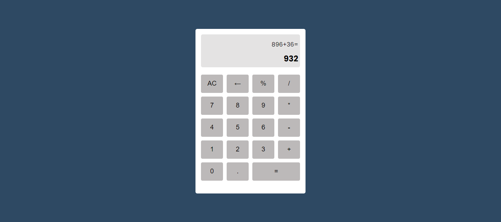

# React Calculator



## Introduction

This project is a simple calculator built using React.js. It supports basic arithmetic operations such as addition, subtraction, multiplication, division and percentage. The calculator UI is styled using Tailwind CSS.

## Live Demo

Check out the live demo [here](https://react-calculator-ten-blue.vercel.app/).

## Features

- Basic arithmetic operations: addition, subtraction, multiplication, division and percentage.
- Responsive design with rounded buttons.
- Clear button to reset the calculation.
- Equals button to evaluate the expression.

## Installation

1. **Clone the repository:**

   ```bash
   git clone https://github.com/ShashikantBharti/react-calculator.git
   cd react-calculator
   ```

2. **Install dependencies:**

```bash
npm install
```

3. **Start the development server:**

```bash
npm run dev
```

4. **Open your browser**

```bash
http://localhost:5173
```
